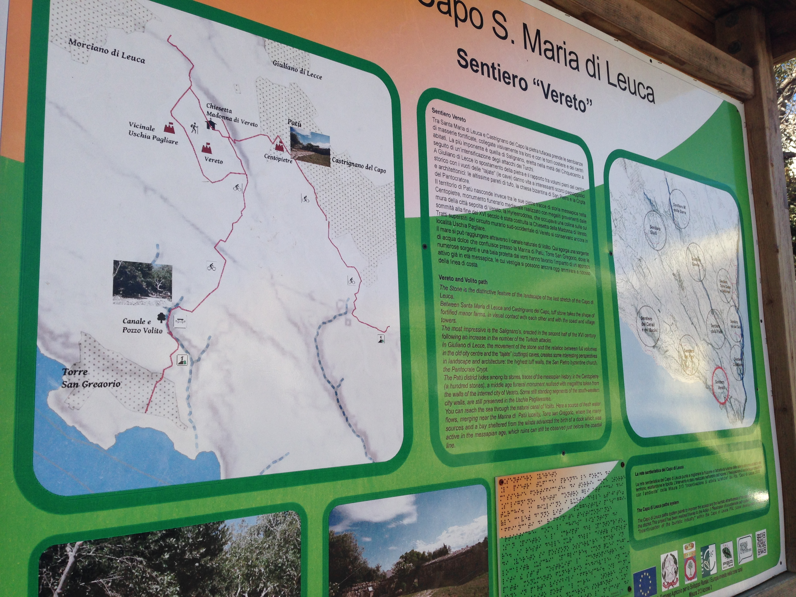

{:width="100%"}

__Paiara Pedone__ befindet sich auf einem nach süden orientierten Berghang, eingekriest von Olivenbaum Plantage und grüne Felder.

Das Haus gibt einen Blick aufs Meer über das Bucht von Felloniche. Der Strand Felloniches ist circa 400 meter entfernt durch einen rühigen füssgangerweg. Der historischer Hafen San Gregorios ist genau so leicht erreichbar zu Fuss. 

{:.image.centre}

__Paiara Pedone__ ist auch nur 300m vom Wanderweg _Sentiero Vereto'_ entfernt. Der Wanderweg folgt der Pfad einer untergrund Brunnen namens [_'Pozzo Volito'_](http://www.ilmiosalento.com/?p=1428) welches den Berghang hinunter zu quellen ins Mer fliesst. Wen man den Sentiero berg auf folgt, kommt man auf den historische ruinen der Messapiane stadt ['Vereto'](https://it.wikipedia.org/wiki/Vereto) welches panoramische ausblicke aufs ganze Halbinsel bietet.

## Vereto Trail

{:.image.centre}

## Borghi von Patu und Castrignano (Mittelaterliche Städte) 
Der Wanderweg führt durch einige der zum Teil älteste sehenswürdigkeiten und monumenten Puglias. Unter dessen der [Centropietre](https://it.wikipedia.org/wiki/Centopietre) (9er Jahrhundert) und die [Chiesa della Madonna di Vereto](http://www.salogentis.it/2013/12/03/la-chiesa-della-madonna-di-vereto/) (17er Jahrhundert). Der Sentiero endet am Borghi (Mittelalterliche städte Patu and Castrignano, dessen dank ihre isolierten geographische lage zum grossten teils ihre authentische historische Charakter nicht verloren haben. 

## Canale del Ciolo
Ein Kilometer Ostlich Castrignanos liegt _Gagliano del Capo_, wo man zugang zu den _Ciolo_ Wanderweg finden kann. Dies führt ein steiles Tal hinunter zu den Adriatisches Küste und Meer. 

{:.image.centre}

## le Grotte
Ein Kilometer südlich von __Paiara Pedone__ liegen die Höhlen _Grotta del Drago_ (Drachens Höhle) und _la Grotta degli inammorati_ (The Lovers' Cave) und la Grotta delle Tre Porte (3 Door Cave).

## Punta Ristola/Leuca
Zwei Kilometer südlich von __Paiara Pedone__ findet man den _Punta Ristola_ und alte Hafenstadt von _Santa Maria de Leuca_ ganz am endpunkt der Halbinsel.

## Torre Vado/Pali
Ein Kilometer nordlich von __Paiara Pedone__ findet man der alte Fischereihafen _Torre Vado_. Von hier aus nordlich laufen zwei kilometer goldene sandstrände und Düne bis nach _Torre Pali_ - ein andere historiche Fischereihafen. 

