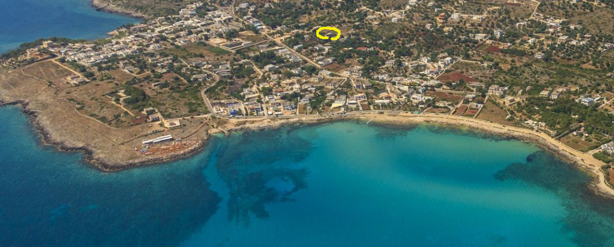
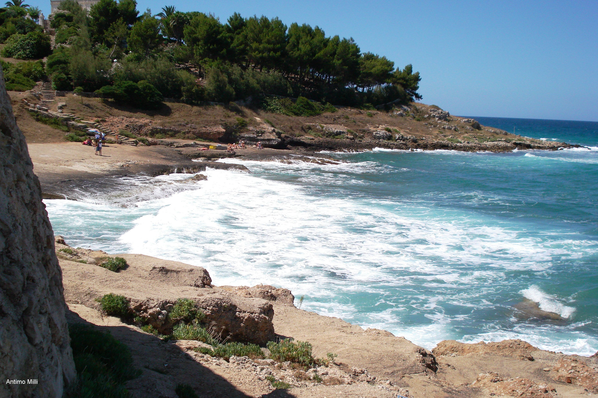
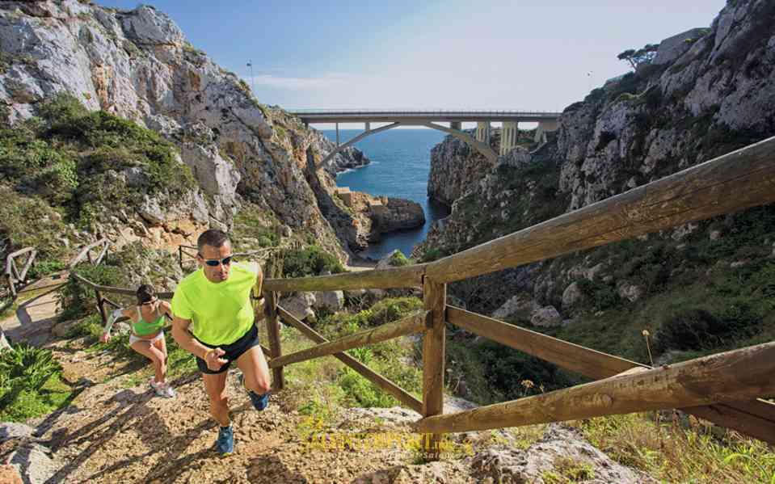

{:width="100%"}

__Paiara Pedone__ is surrounded by olive plantations growing on the south-facing ridge that runs along the Puglian peninsula.

It overlooks the bay of Feloniche, which is a quarter of a mile walk via a quiet pedestrian footpath. It is an equal distance to the other side of the peninsula where you will find the ancient port of San Gregorio.

{:.image.centre}

__Paiara Pedone__ is also just a couple of hundred yards away from the from the 'sentiero vereto' a trail that follows the [_'Pozzo Volito'_](http://www.ilmiosalento.com/?p=1428) - an [underground spring](http://www.associazionearches.it/acqua-dalle-rocce-il-canale-volito-patu/) which runs down the steep slopes of the vereto ridge and flows into the sea at Felloniche. In the heat of the summer people bathe in cold springs which flow out between the rocks near the bay. The Vereto trail skirts a narrow valley and rises to the ridgetop ruins of the ancient Messapian city of [Vereto](https://it.wikipedia.org/wiki/Vereto). This offers views across the peninsula to Santa Maria di Leuca and the Adriatic. 

## Vereto Trail

{:.image.centre}

## Surrounding Borghi (medieval villages) 
The sentiero traverses some of the most picturesque landscapes and ancient monuments in Puglia, including the [Centropietre](https://it.wikipedia.org/wiki/Centopietre) (9th Century) and the [Chiesa della Madonna di Vereto](http://www.salogentis.it/2013/12/03/la-chiesa-della-madonna-di-vereto/) (17th Century). The trail terminates at the medieval villages of Patu and Castrignano, which due to their remote location have managed to preserve their authentic historic character. 

## Canale del Ciolo
A mile or so east of these 'borghi' is _Gagliano del Capo_, a slightly larger town from where one can access the _Ciolo_ trail - a path leading down through the Ciolo mountain valley to the Adriatic coast.

{:.image.centre}

## le Grotte
Travel one mile south along the coast and you will find la Grotta del Drago (The Dragon's Cave) and la Grotta degli inammorati (The Lovers' Cave) and la Grotta delle Tre Porte (3 Door Cave).

## Punta Ristola/Leuca
Two miles to the south along the coast you will find _Punta Ristola_ and the town of Santa Maria de Leuca at the very tip of Italy's heel.

## Torre Vado/Pali
Travel one mile north along the coast and you will reach Torre Vado, an ancient fishing port with intact watch tower. From here northwards there are two miles of white sandy beaches until Torre Pali - another ancient fishing port with a partly submerged watch tower.

